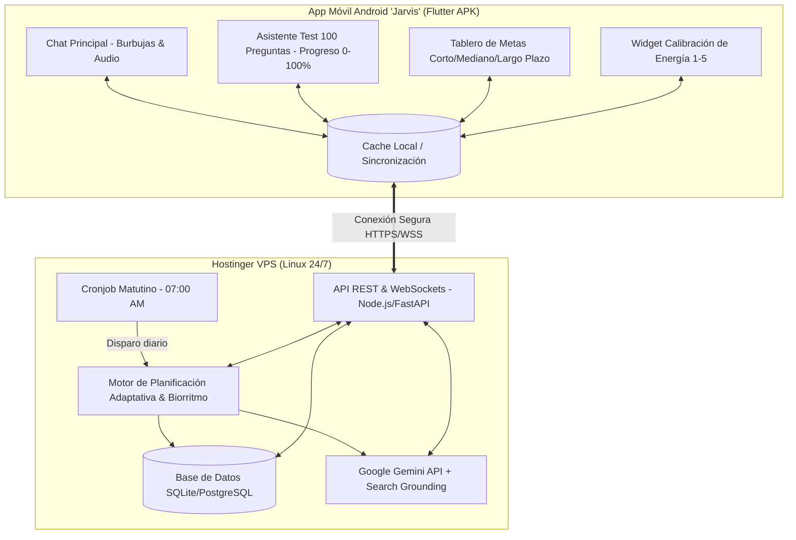

# Especificación de Diseño: Jarvis - Agente Personal y Planificador de Vida

**Fecha:** 2026-09-17  
**Estado:** Aprobado para Planificación  
**Proyecto:** Jarvis Proyecto de Vida  
**Plataformas:** Hostinger VPS (Backend 24/7) + Android Nativo (Flutter APK)

---

## 1. Resumen Ejecutivo
**Jarvis** es un agente personal y planificador de vida inteligente, diseñado para guiar al usuario hacia sus metas de corto (1-6 meses), mediano (1-3 años) y largo plazo (5-10 años). 

A diferencia de las aplicaciones de productividad tradicionales que imponen cargas rígidas e inhumanas, Jarvis cuenta con un **motor de planificación adaptativo a la bipolaridad**: calibra diariamente la energía del usuario, protege el sueño como ancla neurológica sagrada, y opera bajo 3 modos dinámicos (Alta Energía con límites saludables, Ritmo Estable, y Modo Refugio libre de culpa).

El ecosistema se compone de:
1. **Un Backend autónomo 24/7 en un VPS de Hostinger**: Orquesta la base de datos de vida, ejecuta cronjobs matutinos y se comunica con la API de Google Gemini (con búsqueda web).
2. **Una App Android dedicada llamada "Jarvis" (APK)**: Experiencia de chat en tiempo real con estética y fluidez similar a mensajería moderna (WhatsApp), donde se administra el test inicial de 100 preguntas y se recibe el **Morning Briefing** matutino.

---

## 2. Arquitectura General del Sistema

---

## 3. El Test de Diagnóstico de 100 Preguntas (Life Blueprint 360°)

El usuario inicia en la app con un formulario interactivo paso a paso con guardado automático y barra de progreso continua (0% a 100%).

### Las 10 Dimensiones (10 preguntas por dimensión):
1. **Identidad, Principios y Filosofía:** Misión personal, valores inquebrantables, virtudes, definición de triunfo.
2. **Salud Física y Nutrición:** Horas y calidad de descanso, alimentación, masa muscular, resistencia, chequeos médicos.
3. **Psicología, Bipolaridad y Gestión Emocional:** Señales tempranas (pródromos) de fases altas y bajas, desencadenantes de estrés, mecanismos de rescate, relación con la frustración.
4. **Finanzas y Patrimonio:** Ingresos netos, gastos fijos, fondos de emergencia, inversiones, desendeudamiento, número de independencia financiera.
5. **Carrera, Negocios y Maestría:** Empleo/negocio actual, visión a escala, habilidades duras y blandas urgentes por dominar.
6. **Relaciones y Círculo de Confianza:** Relación de pareja, familia, amistades que impulsan vs relaciones drenantes, límites personales.
7. **Rutinas Diarias y Focos de Distracción:** Horas de mayor claridad mental, uso de pantallas, hábitos atómicos de inicio y cierre de día.
8. **Metas a Corto Plazo (1 a 6 meses):** Victorias rápidas inaplazables, hitos medibles, hábitos no negociables a instalar.
9. **Metas a Mediano Plazo (1 a 3 años):** Saltos profesionales, estabilidad patrimonial, cambios de entorno o adquisiciones clave.
10. **Visión a Largo Plazo y Legado (5 a 10+ años):** Estilo de vida ideal en una década, contribución al mundo, legado personal.

### Procesamiento con Gemini
Al finalizar, el backend envía las respuestas a Google Gemini estructurando el **Plan Maestro de Vida**:
- Perfil psicológico y operativo.
- Desglose jerárquico de metas: *Meta 5 años ➔ Hito 1 año ➔ Meta mensual ➔ Acciones diarias*.
- Protocolo de seguridad emocional (qué hacer cuando el usuario está en bajón o en hipomanía).

---

## 4. Motor de Planificación Adaptativa (Especializado en Bipolaridad)

### Los 3 Modos Operativos
- **Modo Alta Energía / Expansión:** 
  - Tareas estratégicas, aprendizaje intensivo, creación.
  - *Freno de mano de Jarvis:* Limita el número de frentes abiertos a un máximo de 3 y prohíbe comprometer horas de sueño.
- **Modo Ritmo Estable (Baseline):**
  - Avance constante en las 3 prioridades del día sin sobreesfuerzo.
- **Modo Refugio / Mínimo Viable (Baja Energía / Bajón):**
  - Se activa cuando el usuario indica energía 1-2 o reporta decaimiento.
  - Jarvis elimina todas las tareas complejas sin juicio ni reproche.
  - Se enfoca en: 1) Hidratación y comida nutritiva, 2) Caminata o sol 15 min, 3) Cero culpa.

### Ancla Circadiana (Protección del Sueño)
- El Morning Briefing se sincroniza con la hora de despertar.
- Jarvis incorpora una hora objetivo de desconexión en el mensaje diario para salvaguardar la estabilidad neurológica.

---

## 5. La App Móvil "Jarvis" (Flutter)

- **Nombre en Android:** Jarvis
- **Paquete:** `com.jarvis.proyectodevida`
- **Componentes de UI:**
  - **Chat Principal:** Burbujas de mensajes enviadas/recibidas, fecha, hora, estado de entrega, indicador de "Jarvis está escribiendo...".
  - **Soporte de Mensajes de Voz:** Grabación de notas de audio enviadas al VPS para transcripción y respuesta contextual.
  - **Card de Morning Briefing:** Formato destacado con botones de acción rápida ("¡Entendido!", "Ajustar horario", "Hoy tengo poca energía").
  - **Vista de Plan Maestro:** Pestaña lateral para revisar el árbol de metas y el avance porcentual de cada objetivo.
  - **Selector de Ánimo:** Acceso rápido para pulsar del 1 al 5 en cualquier momento del día.

---

## 6. Backend en Hostinger VPS

- **Stack:** Node.js (TypeScript) con Express o FastAPI (Python), administrado con PM2 o Docker.
- **Persistencia:** Base de datos SQLite local en modo WAL (con backup automático diario) o PostgreSQL.
- **Conectividad IA:** SDK oficial `@google/genai` o `google-genai` con modelo Gemini 2.5 Flash / Pro, con función de búsqueda en la web integrada (Search Grounding).
- **Seguridad:** Autenticación por token bearer entre la app Flutter y el VPS, HTTPS mediante Let's Encrypt / Certbot.
- **Cronjob Autónomo:** Tarea programada a las 07:00 AM (configurable) que sintetiza y redacta el Morning Briefing diario.

---

## 7. Plan de Verificación y Pruebas
1. **Pruebas Unitarias del Motor de Adaptabilidad:** Validar que al simular energía baja (1/5), el algoritmo reduzca automáticamente la carga de trabajo y active el Modo Refugio.
2. **Pruebas del Cuestionario de 100 Preguntas:** Validar la persistencia de datos parciales, paginación fluida y serialización JSON hacia el backend.
3. **Pruebas de Conexión y Mensajería:** Enviar mensajes de chat desde el emulador/dispositivo Android hacia el VPS y verificar respuestas de Gemini en menos de 2 segundos.
4. **Prueba de Compilación APK:** Generación exitosa de `app-release.apk` verificada con `flutter build apk`.
